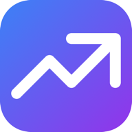
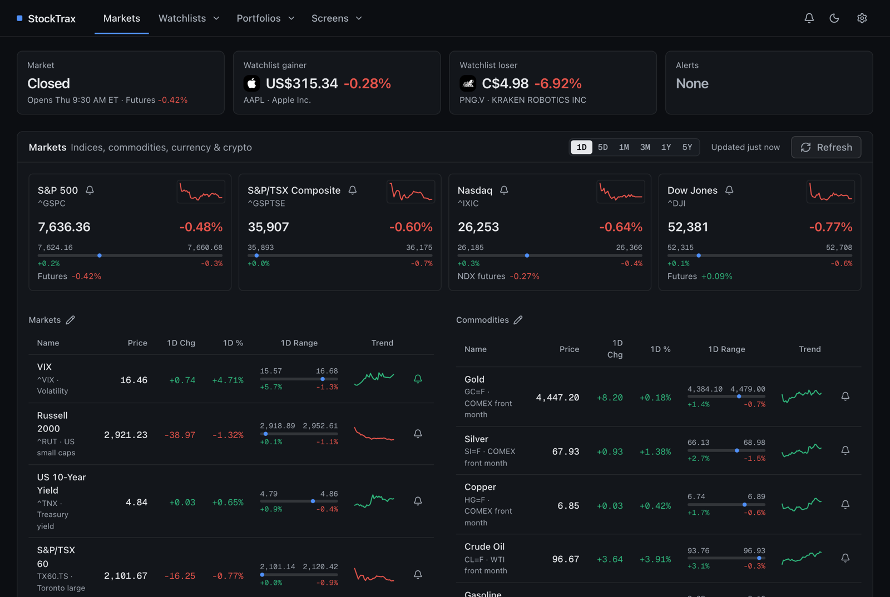

<p align="center">
  
</p>

<h1 align="center">StockTrax</h1>

<p align="center">
  A self-hosted portfolio and watchlist tracker. One container, one SQLite file, no accounts, no API keys.
</p>

<p align="center">
  <a href="https://github.com/SiFoIT/stocktrax/releases"></a>
  <a href="https://github.com/SiFoIT/stocktrax/pkgs/container/stocktrax"></a>
  <a href="https://github.com/SiFoIT/stocktrax/actions/workflows/docker.yml"></a>
  <a href="LICENSE"></a>
  
</p>

<p align="center">
  
</p>

StockTrax is for people who hold stocks and ETFs at one or more brokers and want a
single quiet page that answers "how are things today?". It tracks portfolios from
their transactions, watches the symbols you care about, screens for new ones, alerts
you on moves, and emails you a digest after the close. Prices come from Yahoo Finance,
delayed 15 to 20 minutes, which is plenty for a long-term investor.

It was built by a Canadian investor, so CAD and USD are first-class: portfolios carry
a base currency, cash is tracked in both, and the Markets page leans Canadian by default.

## Quick start

```bash
docker run -d --name stocktrax -p 3000:3000 -v stocktrax-data:/app/data ghcr.io/sifoit/stocktrax:latest
```

Open <http://localhost:3000>. The container creates the database on first start and
migrates it on every restart, so upgrading is `docker pull` and re-create.

Or with Compose, using the [docker-compose.yml](docker-compose.yml) in this repo:

```bash
docker compose up -d
```

> **There is no login.** Anyone who can reach port 3000 can see your holdings, change
> settings, and trigger emails. Keep it on a LAN, a VPN, or behind an authenticating
> reverse proxy.

## Features

**Markets** &nbsp;·&nbsp; A glance row (market status, best and worst watchlist mover,
alerts) above index tiles with sparklines, day ranges and futures. Below that, tables
for indices, commodities, currencies and crypto. Every section is customisable: pick
which symbols appear, or add your own.

**Watchlists** &nbsp;·&nbsp; As many named lists as you like, with symbol autocomplete.
Views for performance, dividends, insider activity and news. Pre- and post-market
prices, 52-week and day range bars, sortable columns.

**Portfolios** &nbsp;·&nbsp; Holdings are computed from buy, sell and dividend
transactions, never typed in by hand. Cash balances in CAD and USD with live FX.
Views for holdings, performance, dividends, dividend returns, insider activity, news
and the full transaction ledger. Analytics for CAGR, sector, asset type and currency
allocation. Import a Wealthsimple CSV and duplicates are skipped.

**Charts** &nbsp;·&nbsp; Line and candlestick from TradingView lightweight-charts, 1D to
5Y, with 50/200 SMA, 12/26 EMA, Bollinger Bands and volume. Chart preferences are
remembered per list.

**Screener** &nbsp;·&nbsp; Build rules that read as sentences ("P/E is below 15",
"dividend yield is at least 3%") across price, moving averages, performance,
valuation, dividends, profitability, risk and analyst metrics. Run them against every
known stock, a watchlist, or a portfolio. Screens autosave.

**Alerts** &nbsp;·&nbsp; Price and performance rules on any watchlist item, holding or
market symbol. Reset strategies (manual, recovery, cooldown, baseline, end of day)
keep a rule from firing all day. History is kept.

**Email digest** &nbsp;·&nbsp; A daily summary after the close and a weekly one on
Saturday morning: markets, your portfolio move, best and worst, watchlist moves,
alerts fired, dividends received, upcoming ex-dividend dates. Plain SMTP, so Gmail,
SendGrid, Mailgun, Resend or a relay of your own all work. A privacy switch drops
every dollar figure and keeps the percentages.

**Backup** &nbsp;·&nbsp; Export everything to one JSON file from Settings and import it
on a fresh install.

## Email digest setup

Open **Settings → Email digest**. Both digests are on by default but nothing sends until
SMTP is configured. For Gmail, create an App Password (2-Step Verification must be on)
and enter:

| Field | Value |
|---|---|
| SMTP host | `smtp.gmail.com` |
| Port | `587`, Implicit TLS off |
| Username | your full Gmail address |
| Password | the 16-character App Password |
| From | `StockTrax <you@gmail.com>` |
| To | one or more addresses, comma-separated |

Press **Send test email**. Any other relay works the same way with its own host, port
and credentials.

**Headless configuration.** These environment variables fill in any field left empty
in the UI:

```
SMTP_HOST  SMTP_PORT  SMTP_SECURE  SMTP_USER  SMTP_PASS
DIGEST_FROM  DIGEST_TO  DIGEST_APP_URL
```

`DIGEST_APP_URL` only adds an "Open StockTrax" link to the footer.

**Scheduling.** The app schedules its own sends while running. A send missed because
the container was down goes out on the next check that same day, and is skipped after
midnight rather than arriving late. To use an external scheduler instead, turn both
toggles off and call the endpoint:

```bash
curl -X POST http://localhost:3000/api/digest -H 'Content-Type: application/json' -d '{"kind":"daily"}'
```

The SMTP password is never returned by the API and is left out of backup exports.

## Running from source

Requires Node.js 22 or newer.

```bash
npm install
npx drizzle-kit push      # create data/stocktrax.db
npm run dev               # http://localhost:3000
```

Other scripts:

| Command | What it does |
|---|---|
| `npm run build` then `npm start` | Production build and serve |
| `npm test` | Vitest unit tests (digest timing, selection, rendering, market symbols) |
| `npm run lint` | ESLint |
| `npx drizzle-kit push` | Apply schema changes after editing `src/lib/db/schema.ts` |

To build the image locally:

```bash
docker build -t stocktrax .
docker run -p 3000:3000 -v stocktrax-data:/app/data stocktrax
```

## How it's built

| | |
|---|---|
| Framework | Next.js 16 App Router, React 19, TypeScript |
| Storage | SQLite via better-sqlite3 and Drizzle ORM, one file under `data/` |
| UI | Tailwind CSS 4, Radix UI primitives, lucide icons |
| Charts | TradingView lightweight-charts for prices, Recharts for allocation |
| Market data | yahoo-finance2, cached in SQLite (1 h daily, 5 min intraday) |
| Email | nodemailer over SMTP, scheduled in-process from `instrumentation.ts` |

The code is laid out by feature under `src/` and described in [CLAUDE.md](CLAUDE.md),
which also holds the design tokens and conventions. Longer design notes live in
[docs/](docs/).

## Releasing

Pushing a `v*` tag builds the image and publishes it to GitHub Container Registry as
`ghcr.io/sifoit/stocktrax:<version>` and `:latest`.

```bash
git tag v0.5.0 && git push origin v0.5.0
```

## Roadmap

Rough order of intent, none scheduled:

- Time-weighted and money-weighted returns over the portfolio value history, with a
  benchmark line.
- Realized gains and adjusted cost base per tax year, in CAD at trade-date rates.
- Background alert evaluation with Web Push, so alerts fire without a tab open.
- A second quote provider behind the Yahoo wrapper, and "data as of" badges when
  the upstream is down.
- Target allocations with drift and rebalancing suggestions.
- Optional authentication for deployments that leave the LAN.

## Data source and disclaimer

Quotes, fundamentals, news and insider data come from Yahoo Finance through the
unofficial [yahoo-finance2](https://github.com/gadicc/node-yahoo-finance2) library,
delayed 15 to 20 minutes. StockTrax is a personal tracking tool, not investment advice.

## License

[MIT](LICENSE)
